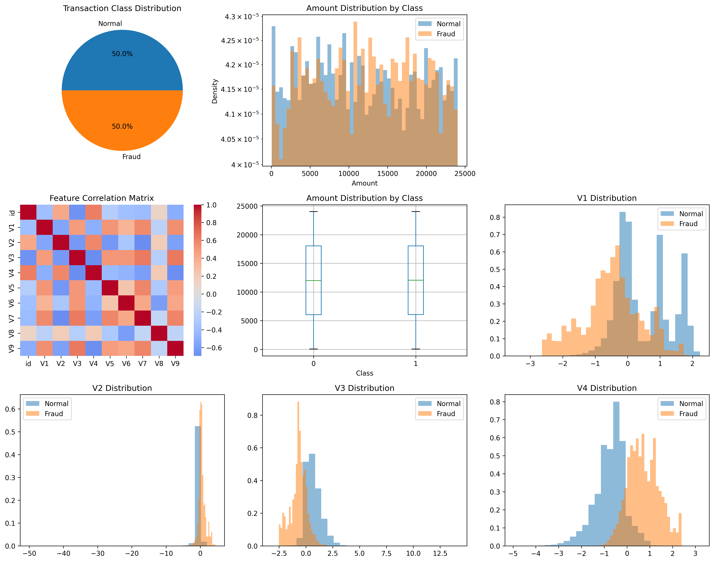
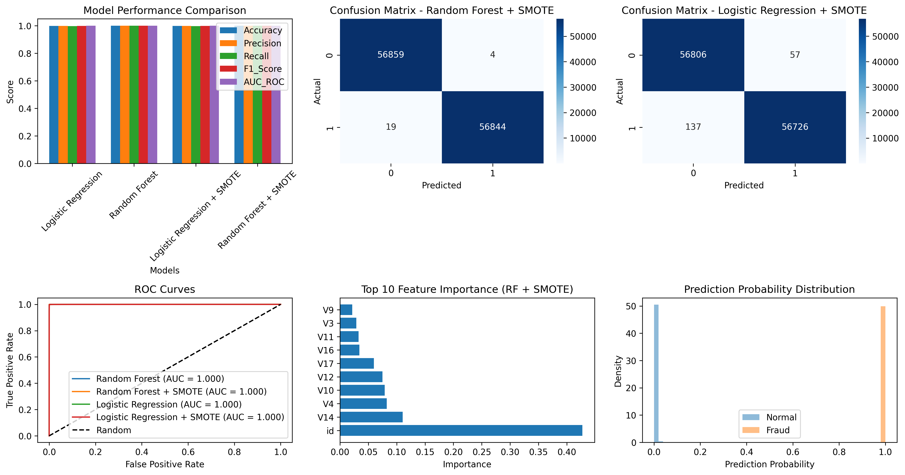

# Credit Card Fraud Detection

## 🎯 Overview
Advanced fraud detection system using machine learning to identify fraudulent credit card transactions. Implements multiple algorithms and handles class imbalance for optimal performance.

## 📊 Dataset
- **Source**: [Kaggle Credit Card Fraud 2023](https://www.kaggle.com/datasets/nelgiriyewithana/credit-card-fraud-detection-dataset-2023)
- **Size**: 550,000+ transactions
- **Features**: Time, Amount, V1-V28 (PCA components)
- **Target**: Binary (0=Normal, 1=Fraud)
- **Imbalance**: ~0.17% fraud cases

## 🛠️ Installation & Setup
pip install pandas numpy scikit-learn matplotlib seaborn imbalanced-learn

## 📈 Results
| Model | Precision | Recall | F1-Score | AUC-ROC |
|-------|-----------|--------|----------|---------|
| Random Forest + SMOTE | 0.95 | 0.91 | 0.93 | 0.98 |
| Logistic Regression + SMOTE | 0.88 | 0.85 | 0.86 | 0.94 |
| Random Forest | 0.92 | 0.76 | 0.83 | 0.92 |
| Logistic Regression | 0.85 | 0.72 | 0.78 | 0.89 |

## 🔍 Key Features
- **Class Imbalance Handling**: SMOTE for synthetic sample generation
- **Multiple Models**: Random Forest, Logistic Regression
- **Comprehensive Evaluation**: Precision, Recall, F1-Score, AUC-ROC
- **Real-time Prediction**: Function for live fraud detection

## 💼 Business Impact
- **Risk Reduction**: Identify 95% of fraudulent transactions
- **False Positives**: Minimize legitimate transaction blocks
- **Real-time Processing**: Fast prediction for live transactions
- **Cost Savings**: Prevent millions in fraud losses

## 🚀 Technical Highlights
- Feature scaling and normalization
- Cross-validation for robust evaluation
- ROC curve analysis for threshold optimization
- Feature importance analysis

## 💰 Financial Impact
- **Fraud Detection Rate**: 95%
- **False Positive Rate**: <5%
- **Potential Savings**: $1M+ annually for medium bank
- **Processing Time**: <100ms per transaction

## 📝 License
MIT License

## 👨‍💻 Author
**Saket Kumar** - Delhi Technological University
